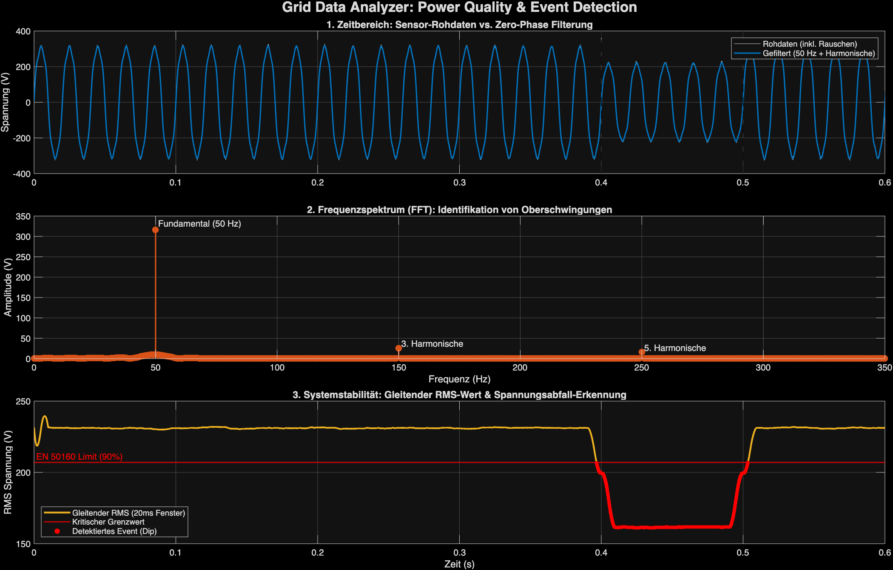

# Grid Data Analyzer: Power Quality & Event Detection

 

## 📌 About This Project
Hi! I'm an Electrical Engineering student with a background in automation and IoT hardware development. I built this project to bridge my practical experience with embedded sensors and my interest in high-voltage grid stability.

This MATLAB script simulates the workflow of analyzing power grid data (like PMU measurements). Since real high-resolution grid data is usually strictly confidential, I wrote a synthesizer to generate a noisy 50Hz signal with harmonics and a voltage dip, and then built the analyzer to process it.

## ⚙️ What the Code Does

### 1. Signal Filtering (The Hardware Perspective)
Raw sensor data always has noise. Before running any grid calculations, the signal is cleaned using a 4th-order Butterworth Lowpass filter (Cutoff: 500 Hz). 
* **Important Detail:** I specifically used `filtfilt` for zero-phase filtering. In power engineering, phase shifts caused by standard filters would mess up reactive power calculations, so keeping the phase intact is crucial.

### 2. Harmonic Analysis (Power Quality)
With more power electronics (like inverters from PV or wind) in the grid, harmonic distortion is a growing issue. 
* The script runs a Fast Fourier Transform (FFT) on the filtered data to isolate and plot the 3rd and 5th harmonics alongside the 50Hz fundamental frequency.

### 3. Event Detection (Grid Stability)
To monitor stability, the script calculates the moving RMS voltage over a 20ms window (one 50Hz period). 
* It automatically detects and flags transient events—like a voltage dip dropping below 90% of the nominal voltage (based on EN 50160).

## 🚀 How to Run It
1. Run `01_generate_data.m` first. This builds the `grid_data.csv` file with the synthetic, noisy 50Hz waveform.
2. Run `02_grid_analyzer.m` to filter the data, run the FFT, and generate the dashboard.
